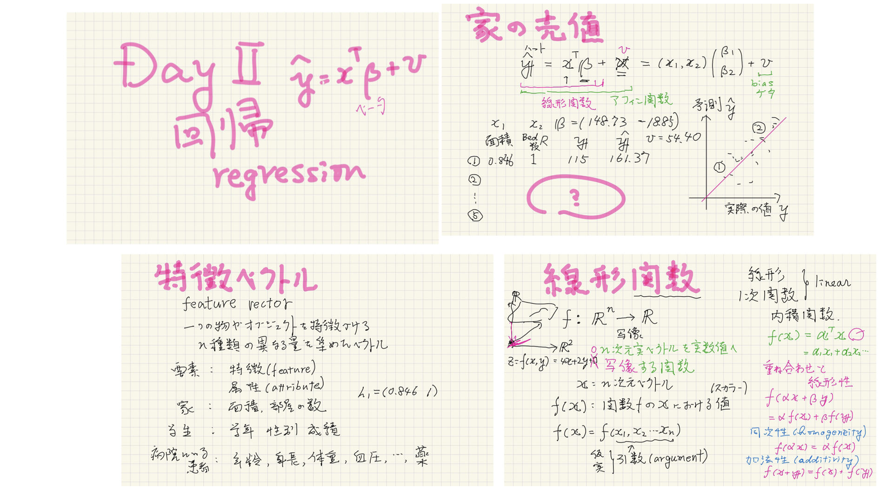
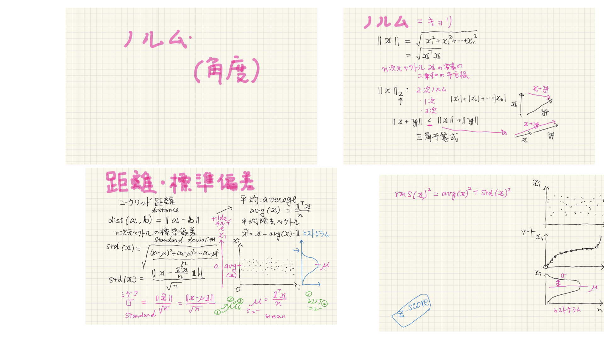
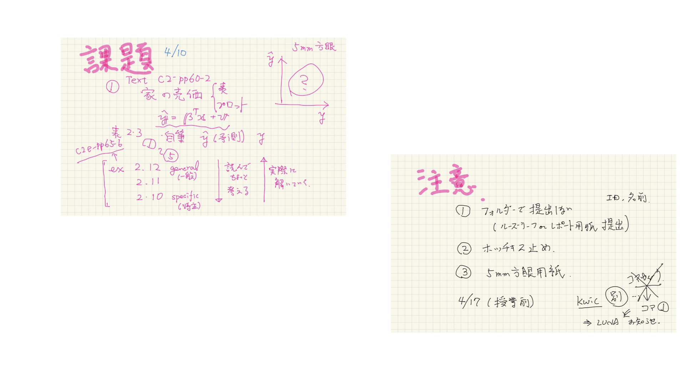

#+OPTIONS: ^:{}
#+STARTUP: indent nolineimages overview num
#+TITLE: template for hyper card stack
#+AUTHOR: Shigeto R. Nishitani
#+EMAIL:     (concat "shigeto_nishitani@mac.com")
#+LANGUAGE:  jp
#+OPTIONS:   H:4 toc:t num:2
#+HTML_HEAD: <link rel="stylesheet" type="text/css" href="style.css" />
#+MACRO: dummy_link @@html:<a href="#">$1</a>@@

# for style.css, never move from here
{{{dummy_link(prev_button)}}} 
{{{dummy_link(up_button)}}}
{{{dummy_link(next_button)}}} 
# for a real link rewrite usual [[\url][]]

* head1
** head2
- list

#+begin_src ruby
name = ARGV[0] || 'Rudy'
puts "Hello #{name}."
#+end_src

* .
|   |   |  
