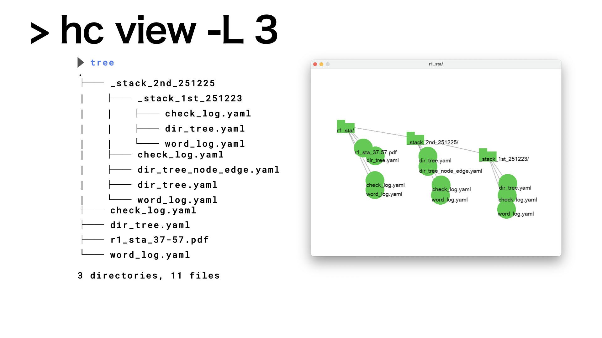
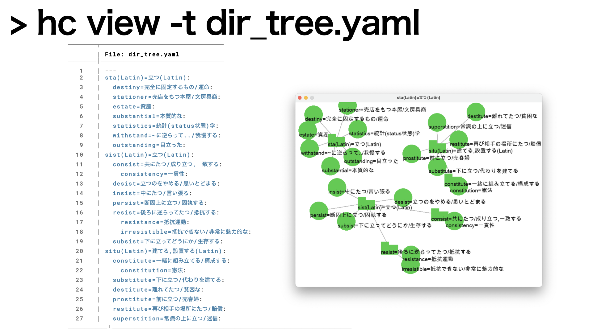
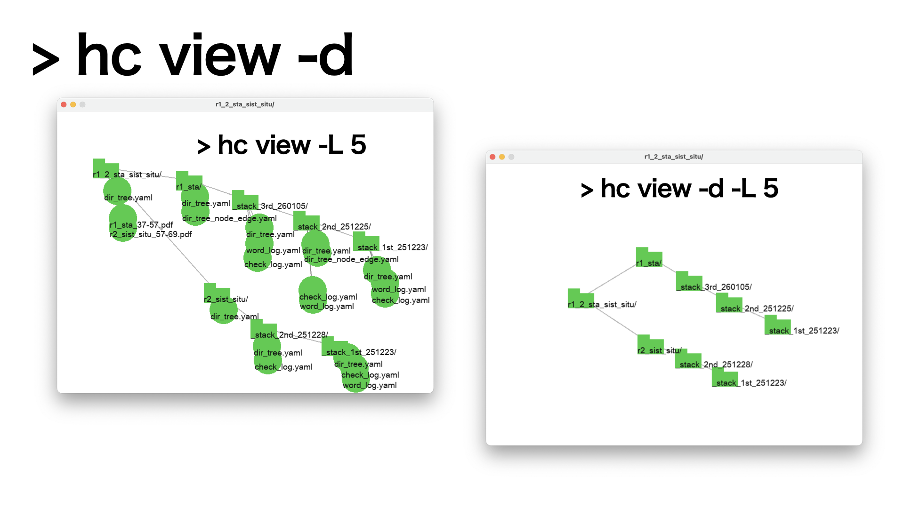

#+OPTIONS: ^:{}
#+STARTUP: indent nolineimages overview num
#+TITLE: mk_sl, hc view
#+AUTHOR: Shigeto R. Nishitani
#+EMAIL:     (concat "shigeto_nishitani@mac.com")
#+LANGUAGE:  jp
#+OPTIONS:   H:4 toc:t num:2
#+HTML_HEAD: <link rel="stylesheet" type="text/css" href=".style.css" />
#+MACRO: dummy_link @@html:<a href="#">$1</a>@@

* Name
Making semi-lattice graph from directory or other yaml files.

* Help
#+begin_src bash
 hc view -h
mk_semi_lattice is running...
Usage: mk_semi_lattice PATH [options]
   or: hc view PATH [options]
Default PATH = '.'
    -L N                             Layer depth (default: 2)
    -n, --node=FILE                  using File from node-edge
    -t, --tree=FILE                  using File from tree
    -i, --index                      Display node ids
    -l, --log [BOOL]                 Enable/disable logging (true/false), and save to config
    -v, --version                    show version
    -d                               Show directories only
    -a                               Show all (files and directories)
    -Y                               YAML exclude mode
    -I, --ignore=PATTERN             Ignore files/dirs matching PATTERN (e.g. '_stack_*|*.yaml')

        When using -I, always use '=' or quote the pattern, e.g.:
            -I='_stack_*|*.yaml' -a
            --ignore='_stack_*|*.yaml' -a
          Multiple patterns can be separated by '|'.
          Wildcards '*' and '?' are supported (like the 'tree' command).
        Do not use -ad; use -a -d for combined flags.
#+end_src

* Usage
** simple (with option Layer 3)
|  

** use option from tree
| 

** use option for dirs only
| 

